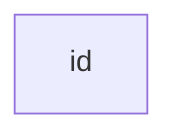

# timr
timer webapp

### Persistence

persistence should be handled by a subscriber to the TimerService, to keep it decoupled (and so implementation can be deferred)

```mermaid
flowchart LR
    id
```